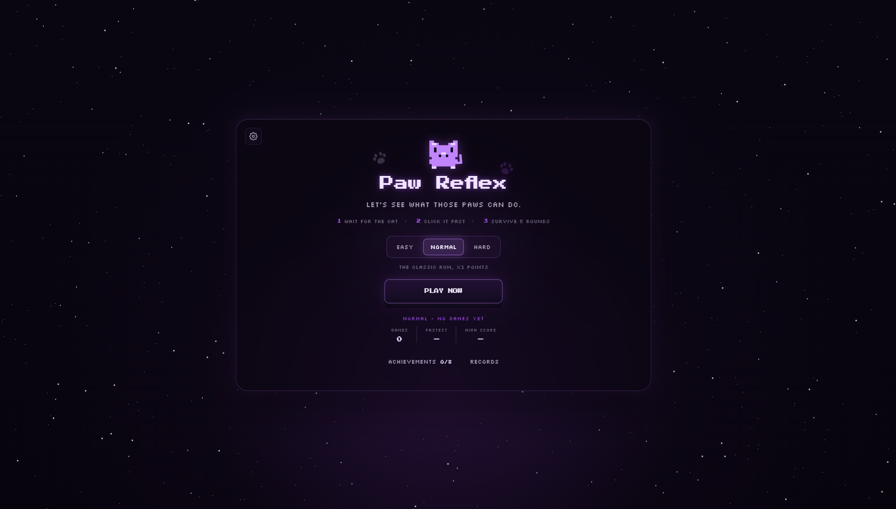
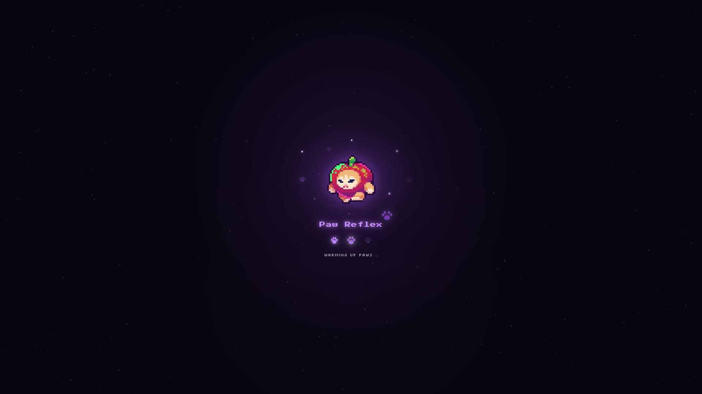
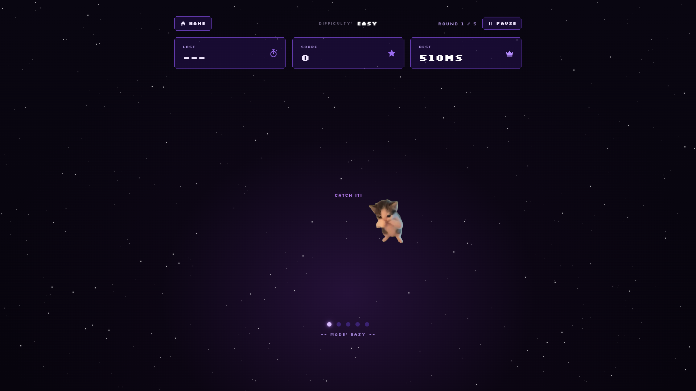
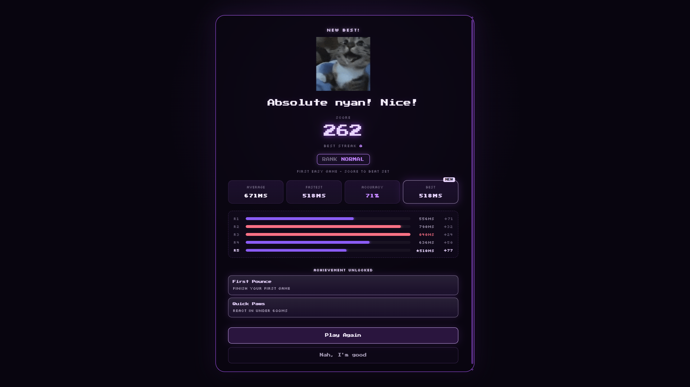

# Paw Reflex

A pixel-art reaction-time game built with HTML, CSS, and JavaScript. Wait for the cat, click it as fast as you can, and survive all 5 rounds!

## Live Demo

**[Play Paw Reflex](https://vinn-devv.github.io/javascript-reaction-challenge/homescreen.html)**

## Screenshots

| Home Screen                          | Loading Screen                             |
| ------------------------------------ | ------------------------------------------ |
|  |  |

| Gameplay                              | Results                             |
| ------------------------------------- | ----------------------------------- |
|  |  |

## Features

- 5 rounds with progressively increasing difficulty
- 3 difficulty modes: Easy, Normal, and Hard
- Reaction-time scoring with combo multipliers
- Results summary with average time, fastest reaction, accuracy, best streak, and round-by-round breakdown
- 8 achievements to unlock
- Personal records and statistics saved in the browser
- Pause menu with restart and quit options
- Settings for music, sound effects, and visual effects
- Pixel-art visuals and an animated loading screen
- Homescreen background music

## How to Play

1. Choose a difficulty on the home screen and press **Play Now**.
2. Press **Start the Round** and wait for the cat to appear.
3. Click the cat as quickly as possible. Clicking too early counts as a miss.
4. Complete all 5 rounds to see your results.
5. Press **Esc** during a game to pause or resume.

## Built With

- HTML
- CSS
- JavaScript
- Browser Local Storage

No external frameworks or libraries were used.

## About the Developer

Hi! I'm **Renzo Cabaya**, a BSIT student specializing in Web Development and an aspiring Software Engineer.

I built Paw Reflex as a personal project to practice and strengthen my skills in front-end web development, JavaScript, and interactive user interface design.

## Credits & Attributions

This project uses third-party assets. They belong to their respective creators and are not claimed as original work by the developer.

| Asset                 | Credit                                                                        |
| --------------------- | ----------------------------------------------------------------------------- |
| Apple Cat Loading GIF | Created by [@llla_gal](https://giphy.com/llla_gal/)                           |
| Homescreen Music      | [Original track on YouTube](https://youtu.be/0QgRku9uvn8?si=h84uKzotMyEU8fJY) |

All rights to third-party assets remain with their respective creators.
